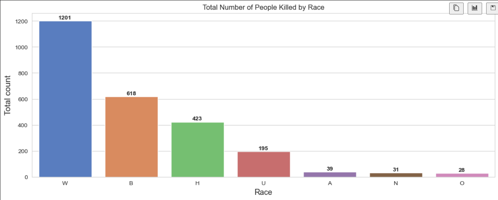
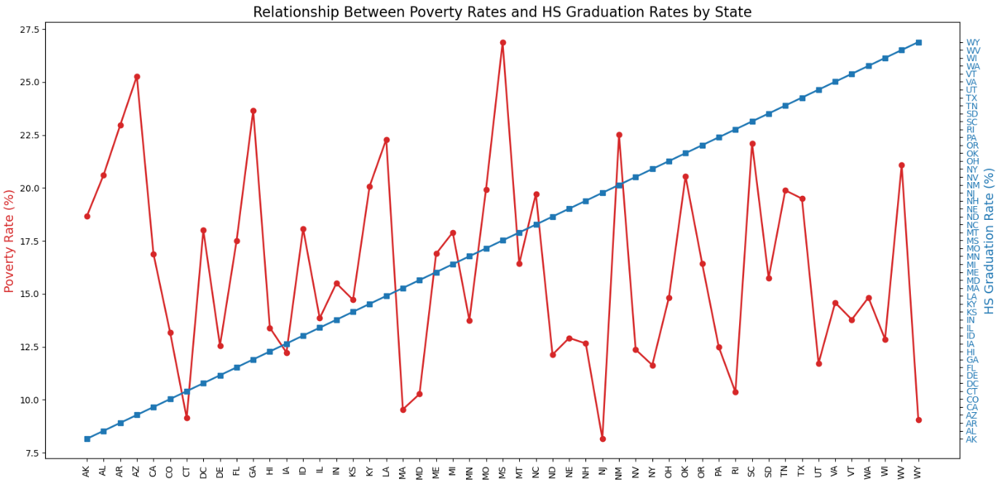
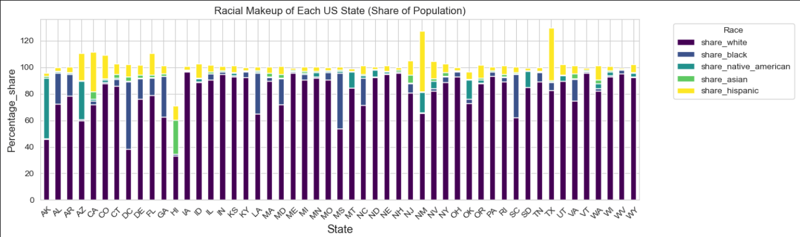
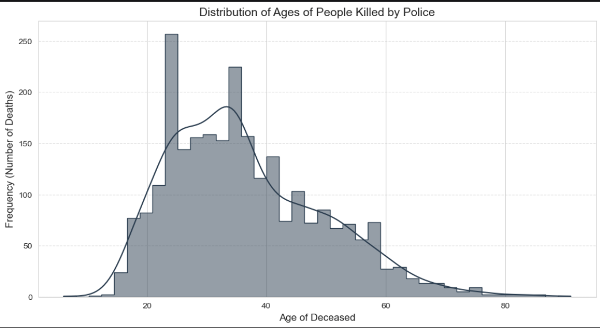
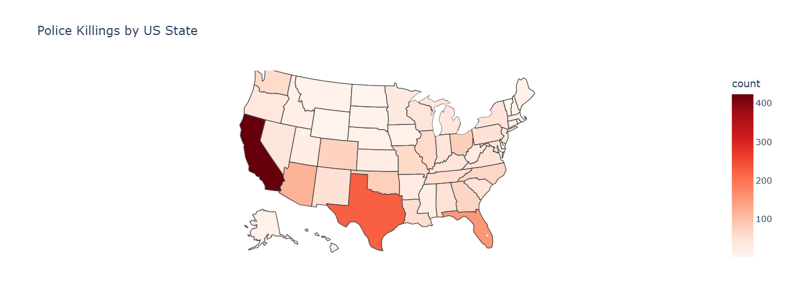
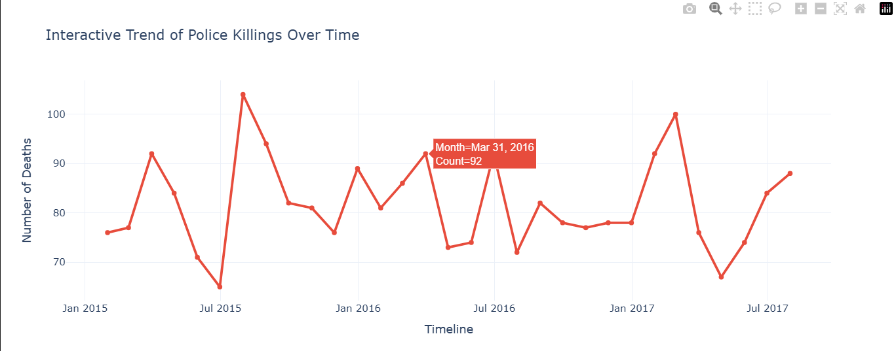

# US Police Fatalities: A Multi-Dimensional Data Analysis

## 👋 Welcome to the Project!
Hello! I am **Divya**, *thankyou for visiting here😊*, and this repository contains my deep-dive analysis into one of the most complex social issues in the United States. 

**The goal of this project is not just to count numbers, but to uncover the stories and patterns hidden within the data. By combining multiple datasets, I aim to provide an evidence-based perspective on how socio-economic factors influence fatal encounters.**

##  What You Will Learn from This Project
*By exploring this notebook, you will see a complete Data Science pipeline in action. Here is what we cover:*

##  Project Overview
**This project is an in-depth data science exploration of **US Police Shootings**. By integrating fatalities records with US Census data (Poverty, Education, and Race), I analyzed the socio-economic and demographic factors that correlate with fatal incidents across the United States.**

##  Tech Stack & Skills
* **Language:** Python 3.x
* **Data Wrangling:** `Pandas`, `NumPy`
* **Data Visualization:** `Matplotlib`, `Seaborn`, `Plotly Express` (Interactive)
* **Time-Series Analysis:** Resampling (Downsampling) & Trend Modeling
* **Geospatial Analysis:** Interactive Choropleth Mapping

##  Key Insights & Visualizations

### 1. Demographic & Racial Disparity
While White individuals represent the highest absolute number of fatalities, this analysis reveals a significant **disproportionate impact** on minorities. By contrasting "Death Share %" with "Population Share %," the data highlights systemic disparities.

## (a)Insert Race Distribution Chart

## (b) Relationship Between Poverty Rates and HS Graduation Rates by State

### 2. Socio-Economic Correlation (Poverty vs. Education)
Using a `Twin Axes` chart, I identified a strong inverse relationship between **Poverty Rates** and **High School Graduation** levels. Higher poverty and lower education levels often overlap in states with high fatality counts.

## Distribution of Ages of People Killed by Police

### 3. Geographical Hotspots (Choropleth Map)
I utilized **Plotly Express** to create an interactive map identifying "Fatalities Intensity" by state. California, Texas, and Florida emerged as the states with the highest total counts.

### 4. Time-Series Trend Analysis (Resampling)
I applied **Monthly Resampling (Downsampling)** to convert daily incident records into a clear monthly trend. This allowed me to look past the daily "noise" to see if the rate of shootings was changing over time.

##  Data Cleaning & Preprocessing
To ensure an accurate analysis, several critical data cleaning steps were performed:
* **Name Normalization:** Cleaned city names in Census data (removed suffixes like "city", "town", and "CDP") to ensure successful merging with the Fatalities dataset.
* **Datetime Conversion:** Converted date columns to `datetime64[ns]` format to enable time-series functionality and resampling.
* **Handling Missing Data:** Addressed null values in race and age columns to maintain statistical integrity.

## Final Reflections & Conclusions
* **Trend Stability:** The analysis shows that the rate of fatalities remained remarkably consistent (avg. 70-100 per month) throughout 2015-2017, with no major decline.
* **Mental Health:** Approximately **25%** of victims showed signs of mental illness, emphasizing the need for better crisis intervention strategies.
* **Context Matters:** By merging census data, the project proves that social conditions (poverty/education) are deeply linked to the frequency of these incidents.

## AUTHOR:--
**DIVYA😊😊**